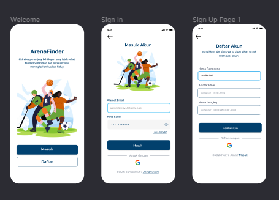

 

 

<h3 align="center">ArenaFinder Mobile Application</h3>

:basketball: Aplikasi pencarian informasi tempat olahraga di Kabupaten Nganjuk :basketball:

<!-- Project Shields -->

  [![Forks][forks-shield]][forks-url]
  [![Stargazers][stars-shield]][stars-url]
  [![Contributors][contributors-shield]][contributors-url]
  [![Last Commit][commit-shield]][commit-url]
  <!-- [![Issues][issues-shield]][issues-url] -->

  [contributors-shield]: https://img.shields.io/github/contributors/haqiachd/ArenaFinder-Mobile.svg?style=for-the-badge
  [contributors-url]: https://github.com/haqiachd/ArenaFinder-Mobile/graphs/contributors
  [forks-shield]: https://img.shields.io/github/forks/haqiachd/ArenaFinder-Mobile.svg?style=for-the-badge
  [forks-url]: https://github.com/haqiachd/ArenaFinder-Mobile/network/members
  [stars-shield]: https://img.shields.io/github/stars/haqiachd/ArenaFinder-Mobile.svg?style=for-the-badge
  [stars-url]: https://github.com/haqiachd/ArenaFinder-Mobile/stargazers
  [commit-shield]: https://img.shields.io/github/last-commit/haqiachd/ArenaFinder-Mobile.svg?style=for-the-badge
  [commit-url]: https://github.com/haqiachd/ArenaFinder-Mobile/commits
  [issues-shield]: https://img.shields.io/github/issues/haqiachd/ArenaFinder-Mobile.svg?style=for-the-badge
  [issues-url]: https://github.com/haqiachd/ArenaFinder-Mobile/issues

  <a href="https://drive.google.com/drive/folders/1c9xHuEOusnqJxNEYW4B3H-rG1FlXcvvt?usp=sharing" style="font-weight: bold;">ArenaFinder MySQL Database</a>
  &nbsp;&nbsp;
  <a href="https://github.com/mahen-alim/ArenaFinder-Web" style="font-weight: bold;">ArenaFinder Website Repository</a>
 &nbsp;&nbsp;
  <a href="https://github.com/haqiachd/ArenaFinder-Mobile-RestApi" style="font-weight: bold;">ArenaFinder Mobile Rest API</a>

---

<!-- Table of Contents -->

  
Table of Contents

  <ol>
    <li><a href="#desc_project">Deskripsi Aplikasi</a></li>
    <li>
      <a href="#ss_app">Screenshot Tampilan</a>
      <ul>
        <li><a href="#ss_app">Tampilan 1</a></li>
      </ul>
    </li>
    <li>
    <a href="#fitur">Fitur Aplikasi</a>
      <ul>
        <li><a href="#fitur-1">Fitur 1</a></li>
        <li><a href="#fitur-2">Fitur 2</a></li>
        <li><a href="#fitur-3">Fitur 3</a></li>
        <li><a href="#fitur-4">Fitur 4</a></li>
    </li>
   <li>
    <a href="#contributor">Contributor</a>
      <ul>
        <li><a href="https://github.com/haqiachd">Achmad Baihaqi</a></li>
        <li><a href="https://github.com/afrizalalka">Afrizal Wahyu Alkautsar</a></li>
        <li><a href="https://github.com/yuniarsih">Ninik Yuniarsih</a></li>
        <li><a href="https://github.com/mahen-alim">Syafrizal Wd Mahendra</a></li>
        <li><a href="https://github.com/WidyaRaisyaSal17">Widyasari Raisya Salsabila</a></li>
      </ul>
    </li>
   <li><a href="#kontak-kami">Kontak Kami</a></li>
  </ol>

## Deskripsi Aplikasi 
Aplikasi ini memberikan informasi lengkap tentang tempat-tempat olahraga yang tersedia, termasuk lokasi, fasilitas yang ditawarkan, jam operasional, dan ulasan dari pengguna lain. Anda dapat dengan mudah mencari tempat yang sesuai dengan preferensi Anda, mengakses informasi kontak, dan bahkan merencanakan kunjungan Anda.

## Screenshot Tampilan

#### Tampilan Welcome, SignIn SignUp

## Fitur Aplikasi 

### Fitur 1
ini fitur 1

### Fitur 2
ini fitur 2

### Fitur 3
ini fitur 3

### Fitur 4
ini fitur 4

## Contributor
- Achmad Baihaqi &nbsp; [[Github]](https://github.com/haqiachd)
- Afrizal Wahyu Alkautsar &nbsp; [[Github]](https://github.com/AfrizalAlka)
- Ninik Yuniarsih &nbsp; [[Github]](https://github.com/yuniarsih)
- Syafrizal Wd Mahendra &nbsp; [[Github]](https://github.com/mahen-alim)
- Widyasari Raisya Salsabila &nbsp; [[Github]](https://github.com/WidyaRaisyaSal17)

## Kontak Kami
Jika Anda memiliki pertanyaan atau memerlukan bantuan, silakan hubungi kami melalui email di [arenafinder.app@gmail.com](mailto:arenafinder.app@gmail.com).
