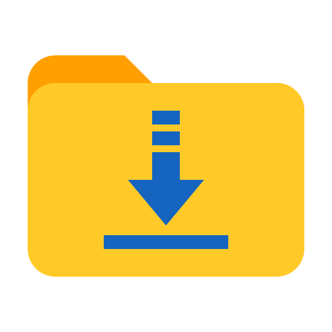
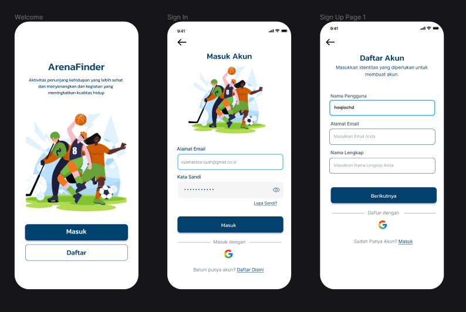
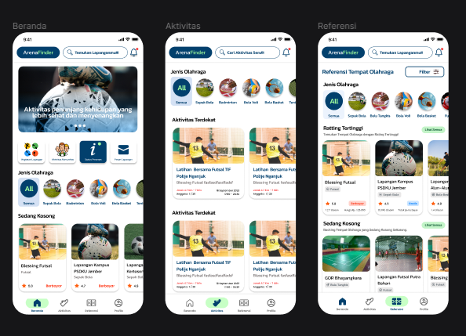

<br>
<p align="center">
 <a href="https://www.youtube.com/watch?v=t9VWICGOD90&ab_channel=HITSRecords"></a>
</p>

<h3 align="center">ArenaFinder Mobile Application</h3>
<p align = "center">:basketball: Aplikasi pencarian informasi tempat olahraga di Kabupaten Nganjuk :basketball:</p>

<!-- Project Shields -->
<span align="center">

[![Forks][forks-shield]][forks-url]
[![Repo Size][repo-shield]][repo-url]
[![Contributors][contributors-shield]][contributors-url]
[![Last Commit][commit-shield]][commit-url]
  <!-- [![Stargazers][stars-shield]][stars-url] -->
  <!-- [![Issues][issues-shield]][issues-url] -->

[repo-shield]: https://img.shields.io/github/repo-size/haqiachd/ArenaFinder-Mobile.svg?style=for-the-badge
[repo-url]: https://img.shields.io/github/repo-size/haqiachd/ArenaFinder-Mobile.svg
[contributors-shield]: https://img.shields.io/github/contributors/haqiachd/ArenaFinder-Mobile.svg?style=for-the-badge
[contributors-url]: https://github.com/haqiachd/ArenaFinder-Mobile/graphs/contributors
[forks-shield]: https://img.shields.io/github/forks/haqiachd/ArenaFinder-Mobile.svg?style=for-the-badge
[forks-url]: https://github.com/haqiachd/ArenaFinder-Mobile/network/members
[stars-shield]: https://img.shields.io/github/stars/haqiachd/ArenaFinder-Mobile.svg?style=for-the-badge
[stars-url]: https://github.com/haqiachd/ArenaFinder-Mobile/stargazers
[commit-shield]: https://img.shields.io/github/last-commit/haqiachd/ArenaFinder-Mobile.svg?style=for-the-badge
[commit-url]: https://github.com/haqiachd/ArenaFinder-Mobile/commits
[issues-shield]: https://img.shields.io/github/issues/haqiachd/ArenaFinder-Mobile.svg?style=for-the-badge
[issues-url]: https://github.com/haqiachd/ArenaFinder-Mobile/issues

</span>

<p align="center">
<a href="https://drive.google.com/drive/folders/1c9xHuEOusnqJxNEYW4B3H-rG1FlXcvvt?usp=sharing" target="_blank" style="font-weight: bold;">MySQL Database</a>
&nbsp;&nbsp;
<a href="https://github.com/mahen-alim/ArenaFinder-Web" target="_blank" style="font-weight: bold;">Website Repository</a>
&nbsp;&nbsp;
<a href="https://github.com/haqiachd/ArenaFinder-Mobile-RestApi" target="_blank" style="font-weight: bold;">Mobile Rest API</a>
&nbsp;&nbsp;
<a href="https://github.com/haqiachd/ArenaFinder-Mobile/blob/main/GUIDE.md" target="_blank" style="font-weight: bold;">Cara Instalasi ArenaFinder</a>
</p>

---

<!-- Table of Contents -->
<details>
  <summary>Table of Contents</summary>
  <ol>
    <li><a href="#desc_project">Deskripsi Aplikasi</a></li>
    <li>
      <a href="#ss_app">Tampilan Aplikasi</a>
    </li>
    <li>
    <a href="#fitur">Fitur Aplikasi</a>
      <ul>
        <li><a href="#informasi-tempat-olahraga">Informasi Tempat Olahraga</a></li>
        <li><a href="#cari-tempat-olahraga">Cari Tempat Olahraga</a></li>
        <li><a href="#booking-tempat-olahraga">Booking Tempat Olahraga</a></li>
        <li><a href="#join-aktivitas-olahraga">Join Aktivitas Olahraga</a></li>
      </ul>
    </li>
   <li><a href="#instalasi-aplikasi">Instalasi Aplikasi</a></li>
   <li>
    <a href="#contributor">Contributor</a>
      <ul>
        <li><a href="https://github.com/haqiachd">Achmad Baihaqi</a></li>
        <li><a href="https://github.com/afrizalalka">Afrizal Wahyu Alkautsar</a></li>
        <li><a href="https://github.com/yuniarsih">Ninik Yuniarsih</a></li>
        <li><a href="https://github.com/mahen-alim">Syafrizal Wd Mahendra</a></li>
        <li><a href="https://github.com/WidyaRaisyaSal17">Widyasari Raisya Salsabila</a></li>
      </ul>
    </li>
   <li><a href="#kontak-kami">Kontak Kami</a></li>
  </ol>
</details>


## Deskripsi Aplikasi <a name = "desc_project"></a>
Aplikasi ini memberikan informasi lengkap tentang tempat-tempat olahraga yang tersedia, termasuk lokasi, harga sewa atau harga masuk, fasilitas yang ditawarkan, dan ulasan dari pengguna lain. Anda dapat dengan mudah mencari tempat yang sesuai dengan preferensi Anda, mengakses informasi kontak, dan bahkan merencanakan kunjungan Anda.

Anda dapat mengunduh aplikasi ArenaFinder Mobile melalui button dibawah ini. <br>
<a href="https://drive.google.com/drive/folders/12XBjgQncHZMxfbNMwWyMXiRuxqCMvgA5?usp=sharing"></a>


## Tampilan Aplikasi<a name = "ss_app"></a>

### Tampilan Welcome, SignIn SignUp


### Tampilan Beranda, Aktivitas, Referensi


### Detail Venue, Detail Aktivitas, Booking Venue


## Fitur Aplikasi <a name = "fitur"></a>

### Informasi Tempat Olahraga
Anda dapat melihat informasi lengkap mengenai tempat-tempat olahraga yang tersedia, termasuk lokasi, harga sewa atau biaya masuk, deskripsi tempat, kontak pengelola, dan berbagai informasi lainnya tentang tempat olahraga dalam aplikasi ini.

### Cari Tempat Olahraga
Anda dapat mencari tempat olahraga yang sesuai dengan kriteria Anda, seperti menemukan tempat olahraga terdekat dari lokasi Anda, melihat tempat olahraga yang memiliki jadwal kosong pada hari ini, atau mencari tempat olahraga yang tersedia secara gratis, berbayar, atau untuk disewa.

### Booking Tempat Olahraga
Anda dapat melakukan pemesanan tempat olahraga melalui aplikasi ini dengan cara yang sangat mudah. Anda hanya perlu mencari tempat olahraga yang diinginkan, memilih jadwal yang tersedia, dan kemudian menerima konfirmasi dari pengelola lapangan.

### Join Aktivitas Olahraga
Anda dapat bergabung dalam berbagai aktivitas seru di tempat olahraga, seperti kompetisi, perlombaan, atau kegiatan lainnya melalui aplikasi ArenaFinder ini.

## Instalasi Aplikasi
Saat ini, aplikasi ArenaFinder berbasis mobile masih dalam tahap pengembangan dan belum tersedia di ```PlayStore```. Jika Anda tertarik untuk mencoba aplikasi mobile ArenaFinder, silakan mengikuti petunjuk yang terdapat dalam Panduan Pengguna yang ada dalam file <a href="https://github.com/haqiachd/ArenaFinder-Mobile/blob/main/GUIDE.md" target="_blank" style="font-weight: bold;">GUIDE.md</a>.

## Contributor
- Achmad Baihaqi &nbsp; [[Github]](https://github.com/haqiachd)
- Afrizal Wahyu Alkautsar &nbsp; [[Github]](https://github.com/AfrizalAlka)
- Ninik Yuniarsih &nbsp; [[Github]](https://github.com/yuniarsih)
- Syafrizal Wd Mahendra &nbsp; [[Github]](https://github.com/mahen-alim)
- Widyasari Raisya Salsabila &nbsp; [[Github]](https://github.com/WidyaRaisyaSal17)

## Kontak Kami
Jika Anda memiliki pertanyaan atau memerlukan bantuan, silakan hubungi kami melalui email di [arenafinder.app@gmail.com](mailto:arenafinder.app@gmail.com).
